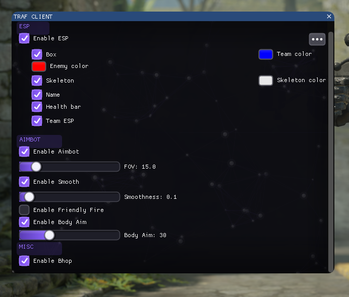
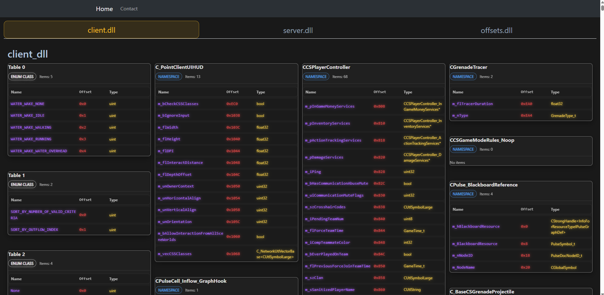

# Traf: CS2 Hack
# CS2 Updated Version: February

## Features
- Aimbot (aim -> fire architectur rather than shoot -> aim)
- Autofire (if crosshair is aiming at head shoot)
- No Recoil
- Bhop
- ESP (name, health, skeleton, bars, colors)
- FoV Custom Croshair
- Cool title at the top

## Table of Contents
- [About](#about)
- [Contact](#contact)
- [Credits](#credits)
- [Reminder](#reminder)
- [License](#license)

## About :information_source:
- Traf Client
- C++ version: 20

## Credits
- [imgui](https://github.com/ocornut/imgui) - framework
- [freetype](https://freetype.org/) - font rasterizer
- [minhook](https://github.com/TsudaKageyu/minhook) - hooking library
- [unknowncheats](https://www.unknowncheats.me/) - for helping building this base

## Reminder
- this project is for educational purposes only.

## License

- This project is licensed under the [MIT License](https://opensource.org/licenses/mit-license.php) - see the [LICENSE](LICENSE) file for details.
